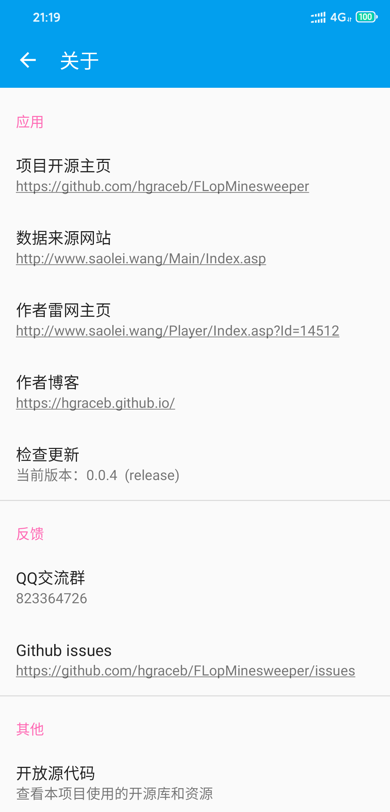

# Flop Mine

## 介绍
Flop Mine是 [扫雷网](http://www.saolei.wang/Main/Index.asp) 的 Android 客户端（非官方），录像及用户数据均来自 [扫雷网](http://www.saolei.wang/Main/Index.asp)。

| 主页                     | 页面跳转                          | 简单筛选                              | 多条件筛选                               | 菜单栏                       |
| ------------------------ | --------------------------------- | ------------------------------------- | ---------------------------------------- | ---------------------------- |
|  |  |  |  |  |

| 偏好设置                         | 关于                      | 开放源代码                            | 新游戏                         | 游戏设置                                  |
| -------------------------------- | ------------------------- | ------------------------------------- | ------------------------------ | ----------------------------------------- |
|  |  |  |  |  |

| 录像播放                           | 查看录像信息                           |
| ---------------------------------- | -------------------------------------- |
|  |  |

### 主要功能

* 扫雷网数据爬取、排版
* 扫雷网录像播放
* 选择本地录像进行播放
* 开始新游戏
* 排序筛选（不同页面可根据神界、人界、初级、高级、Bv等作为筛选排序依据）
* 自定义部分页面的默认用户ID

### 待完成
* 登录
* 评论
* 自定义文件选择界面
* ......

## QQ群

## 关于作者
> 欢迎访问我的 [雷网主页](http://www.saolei.wang/Player/Index.asp?Id=14512) 和 ~~万年不更~~[博客](https://hgraceb.github.io/)，关注我的 [Github](https://github.com/hgraceb/)

## License

    Copyright 2020 Flop
    
    Licensed under the Apache License, Version 2.0 (the "License");
    you may not use this file except in compliance with the License.
    You may obtain a copy of the License at
    
        http://www.apache.org/licenses/LICENSE-2.0
    
    Unless required by applicable law or agreed to in writing, software
    distributed under the License is distributed on an "AS IS" BASIS,
    WITHOUT WARRANTIES OR CONDITIONS OF ANY KIND, either express or implied.
    See the License for the specific language governing permissions and
    limitations under the License.
